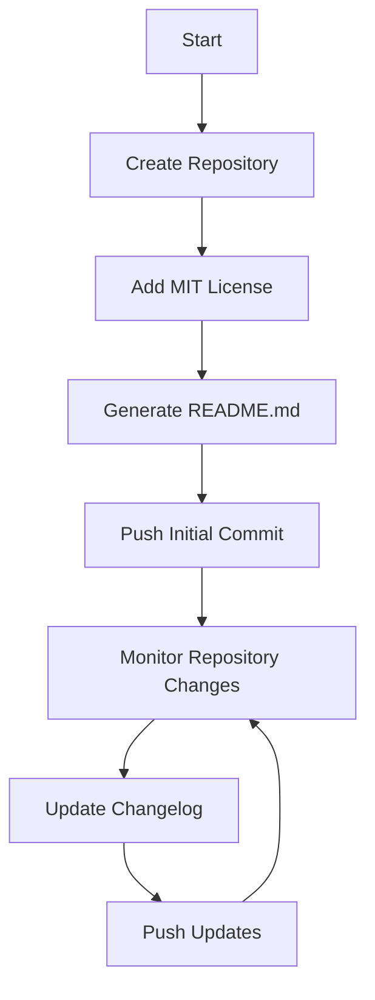

# GitHub Workflow Rules

> Use Github MCP server for managing your GitHub repository effectively.

## AI-Powered Repository Management Workflow

This workflow automates the creation and management of a GitHub repository, including adding an MIT license, generating a `README.md`, and maintaining an updated changelog.

### Steps

1. **Repository Creation**  
    - Automatically create a new repository with the specified name.
    - Add an MIT license file to the repository.

2. **Generate `README.md`**  
    - Write a `README.md` file with a project description, usage instructions, and contribution guidelines.

3. **Changelog Management**  
    - Maintain a `CHANGELOG.md` file to track updates and changes.

4. **Workflow Automation**  
    - Use GitHub Actions to automate updates and log changes.

### Workflow Diagram



### Example GitHub Action

```yaml
name: Repository Management

on:
  push:
     branches:
        - main
  workflow_dispatch:

jobs:
  setup-repo:
     runs-on: ubuntu-latest
     steps:
        - name: Checkout Code
          uses: actions/checkout@v3

        - name: Add MIT License
          run: echo "Adding MIT License" && echo "MIT License content" > LICENSE

        - name: Generate README.md
          run: echo "# Project Title" > README.md && echo "Description of the project." >> README.md

        - name: Update Changelog
          run: echo "## Changelog" > CHANGELOG.md && echo "- Initial Commit" >> CHANGELOG.md

        - name: Commit and Push Changes
          run: |
             git config --global user.name "github-actions[bot]"
             git config --global user.email "github-actions[bot]@users.noreply.github.com"
             git add .
             git commit -m "Initial commit with README, LICENSE, and CHANGELOG"
             git push
```

### Notes

- Ensure the GitHub token has the necessary permissions to create and manage repositories.
- Customize the `README.md` and `CHANGELOG.md` templates as needed.
- Use the workflow diagram to understand the automation process.
- This workflow can be extended to include additional features like issue templates or CI/CD pipelines.